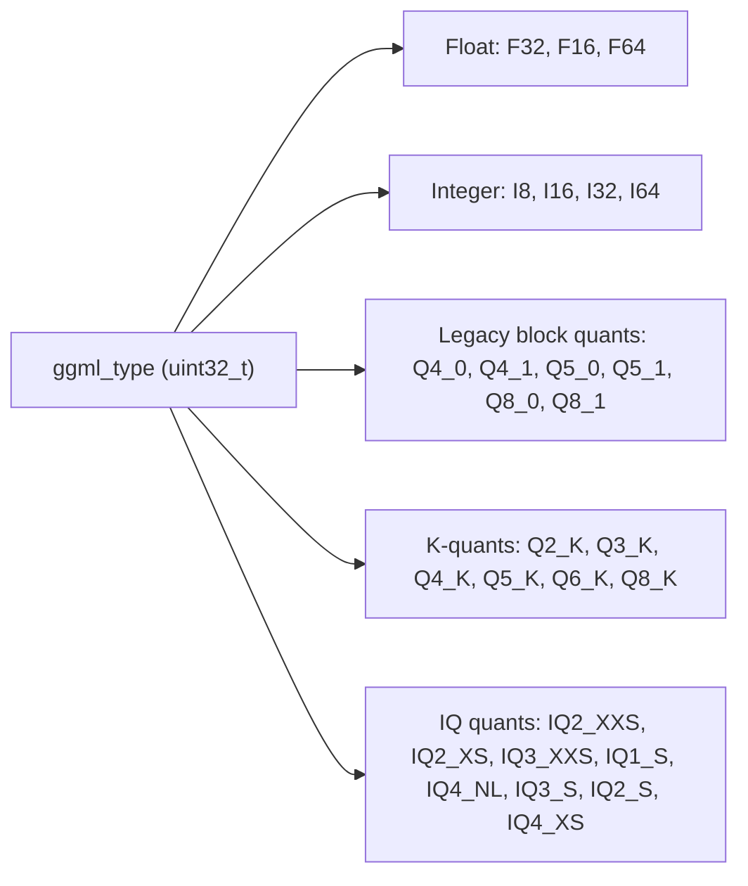
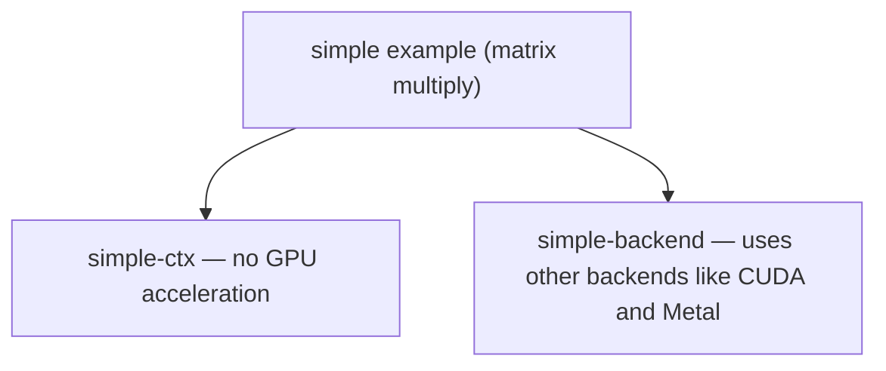

# ggml-runtime (module) — GGML Runtime and Backends

`ggml` is a tensor library for machine learning. Its README describes it as a
low-level, cross-platform implementation with integer quantization support,
broad hardware support, automatic differentiation, ADAM and L-BFGS optimizers,
no third-party dependencies, and zero memory allocations during runtime
(`sd-src/ggml/README.md`). The README explicitly notes the project is under
active development, with some of that work happening in the `llama.cpp` and
`whisper.cpp` repositories.

## Tensor operations

The canonical operation shown in the sources is matrix multiplication. The
`simple` example performs a matrix multiply purely to demonstrate basic `ggml`
and backend handling (`sd-src/ggml/examples/simple/README.md`). Its semantics
differ from textbook row-by-column multiplication: the second matrix is passed
**transposed** and the multiplication is done row-by-row, so the result is also
transposed — `ggml_mul_mat(A, B^T) = C^T`.

Beyond this one operation, the provided excerpts do **not** enumerate the full
tensor-op surface, and no computation-graph API (node construction, graph
building/execution) is visible in the sources. The library's stated purpose is
inference, but the graph machinery itself is not shown here.

## Quantization types

GGUF models carry a `ggml_type` enum (`uint32_t`) that names the supported
weight encodings. The excerpt lists floating-point types, integer types,
legacy block quants, K-quants and "IQ" quants, and marks two legacy entries as
removed (`sd-src/ggml/docs/gguf.md`):



The enum comments in the excerpt note that `GGML_TYPE_Q4_2 = 4` and
`GGML_TYPE_Q4_3 = 5` have had their support removed. This enum — and the
converter/importer that targets it — is where a new quantization type would
have to be declared, though the exact registration point is not visible in the
provided excerpts.

## Backends

The only backend abstraction visible in the sources is at the example level.
The `simple` example ships two variants (`sd-src/ggml/examples/simple/README.md`):



That is: `simple-ctx` does not support GPU acceleration, while
`simple-backend` demonstrates how to use other backends such as CUDA and Metal.
The excerpts do **not** show a backend-registry API, the registration call a
backend makes, or the runtime's backend-selection logic — those parts of the
brief are not visible in the provided sources.

## Loading GGUF models

GGUF is a binary format for storing models for inference with GGML and
executors based on GGML. It is the successor to the `GGML`, `GGMF` and `GGJT`
formats, and is designed to be unambiguous and extensible
(`sd-src/ggml/docs/gguf.md`). Its stated design goals are:

- **Single-file deployment** — distributable and loadable without external files.
- **Extensible** — new features/info can be added without breaking compatibility.
- **`mmap` compatibility** — models can be loaded using `mmap` for fast loading.
- **Easy to use** — loadable/savable with a small amount of code.
- **Full information** — all information needed to load the model is in the file.

The key change from GGJT to GGUF is that hyperparameters are now key-value
metadata rather than a list of untyped values, which lets new metadata be added
without breaking older models.

On disk, GGUF files use a global alignment given by the `general.alignment`
metadata field; where required the file is padded with `0x00` bytes to the next
multiple of that alignment. Fields are written sequentially without alignment
unless otherwise specified, and models are little-endian by default (big-endian
variants are possible; the format currently offers no way to detect endianness,
so absent other information the model should be assumed little-endian).

Filename conventions are also described in the docs: GGUF names follow
`[<Sidecar>]<BaseName><SizeLabel><FineTune><Version><Encoding><Type><Shard>.gguf`,
including optional sidecars such as `mmproj` (multimodal projector) and `mtp`
(multi-token-prediction draft module). How a loader parses these fields, memory-
maps tensors, and binds them to backend buffers is not shown in the provided
excerpts.

## Where new work would go

- **New quantization types** — extend the `ggml_type` enum shown in
  `sd-src/ggml/docs/gguf.md`.
- **New backends** — the `simple-backend` example is the only place the sources
  show multiple backends (CUDA, Metal) being used
  (`sd-src/ggml/examples/simple/README.md`); the concrete registration and
  selection hooks are not visible here.

<!-- relay:claims -->
```relay-claims
{"claims":[{"claim":"ggml is described as a tensor library for machine learning.","path":"sd-src/ggml/README.md","lines":[5,5]},{"claim":"The ggml README states the project is under active development, with some development happening in the llama.cpp and whisper.cpp repositories.","path":"sd-src/ggml/README.md","lines":[7,8]},{"claim":"ggml's listed features include integer quantization support, broad hardware support, automatic differentiation, ADAM and L-BFGS optimizers, no third-party dependencies, and zero memory allocations during runtime.","path":"sd-src/ggml/README.md","lines":[12,18]},{"claim":"The simple example performs a matrix multiplication solely to demonstrate basic use of ggml and backend handling.","path":"sd-src/ggml/examples/simple/README.md","lines":[1,3]},{"claim":"In ggml the second matrix is passed transposed and multiplication is done row-by-row, so ggml_mul_mat(A, B^T) = C^T.","path":"sd-src/ggml/examples/simple/README.md","lines":[24,38]},{"claim":"simple-ctx does not support GPU acceleration, while simple-backend demonstrates how to use other backends like CUDA and Metal.","path":"sd-src/ggml/examples/simple/README.md","lines":[44,50]},{"claim":"GGUF is a binary file format for storing models for inference with GGML and executors based on GGML.","path":"sd-src/ggml/docs/gguf.md","lines":[1,3]},{"claim":"GGUF is the successor file format to GGML, GGMF and GGJT, designed to be unambiguous and extensible.","path":"sd-src/ggml/docs/gguf.md","lines":[5,6]},{"claim":"GGUF's desired features include single-file deployment, extensibility, mmap compatibility, ease of use, and containing all information needed to load a model.","path":"sd-src/ggml/docs/gguf.md","lines":[13,19]},{"claim":"The key difference between GGJT and GGUF is the use of a key-value structure for hyperparameters (metadata) rather than a list of untyped values.","path":"sd-src/ggml/docs/gguf.md","lines":[21,22]},{"claim":"GGUF files use a global alignment given by the general.alignment metadata field and are padded with 0x00 bytes to the next multiple of that alignment.","path":"sd-src/ggml/docs/gguf.md","lines":[71,75]},{"claim":"The ggml_type enum includes float, integer, legacy block-quant, K-quant and IQ quantization types, and notes that Q4_2 and Q4_3 support has been removed.","path":"sd-src/ggml/docs/gguf.md","lines":[84,112]}]}
```
