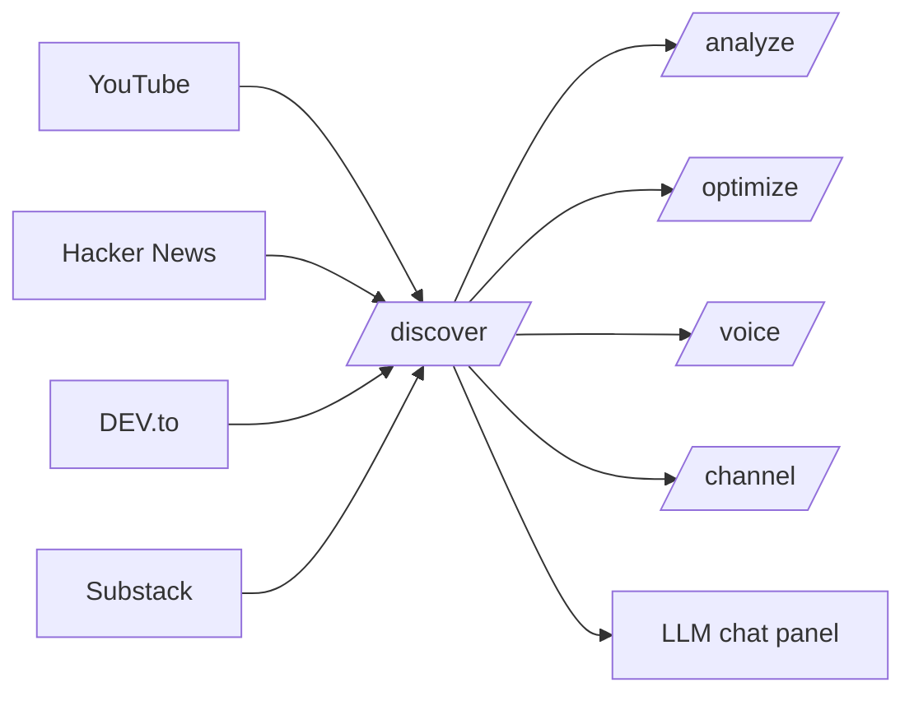

# Project Overview

**Outlierly** (internal package name `tubeforge`) is a content-discovery and creator-workflow app. Per `README.md`, it surfaces outlier-performing videos and articles across YouTube, Hacker News, DEV.to, and Substack, then helps turn them into scripts, social posts, and headline variations with an LLM-powered chat panel.

> **Naming caveat:** the user-facing brand is **Outlierly**, but the internal package name (`tubeforge`), storage keys, cookies, and window events stay `tubeforge` for backward compatibility — `README.md` asks contributors not to rename them.

## What it does

From `README.md`'s feature list:

- **Multi-source discovery** — Hacker News, DEV.to, Substack, and YouTube aggregated into a single research workspace.
- **Block, filter, and track** — mute noisy sources, follow creators, organise findings into lists.
- **LLM chat panel** — generate scripts, social posts, and headline variations from anything you find.
- **Structure analysis** — break down video and article structures (hook, pacing, payoff) so you can model them.
- **SEO optimizer** — improve titles, tags, and descriptions with score calibration.
- **Voice profile builder** — capture a creator's tone and reuse it for consistent drafts.
- **Channel analytics** — per-channel performance insights and trend tracking.
- **Auth & persistence** — Firebase email/password and Google sign-in, with per-user Firestore isolation.

## User-facing areas

`README.md`'s route table maps each area to a page:

- **Discover** — `/discover` is the **main research workspace**: feed, filters, creators/lists, channel tabs, and the workspace board.
- **Analyze** — `/analyze`: structure analysis results (video/article).
- **Optimize** — `/optimize`: the SEO optimizer.
- **Voice** — `/voice`: the voice profile builder.
- **Channel** — `/channel`: per-channel analytics.
- **Workspace** — the README describes the *workspace board* as part of `/discover`; it does **not** document a standalone `/workspace` route.

Other documented routes: `/` (home — onboarding status, daily streak, quick nav), `/dashboard`, `/settings/performance`, `/onboarding`, and `/auth/login` + `/auth/signup`. API handlers live under `/api/*`.

Discovery is the hub; analysis, optimization, voice, and channel views hang off it:



## Stack

- **Next.js 16** (App Router) + **React 19** + **TypeScript** (strict mode).
- **Firebase** — Auth (email/password + Google) + Firestore.
- **Tailwind CSS v4** + **shadcn/ui** on **`@base-ui/react`**.
- **TanStack React Query** for server state; **Zod** for validation.
- Scraping uses `undici`, `youtube-transcript`, `youtubei.js`, and `scrape-youtube`; browser-based `puppeteer-extra` / `playwright` is available, but the only active sources are HN, DEV.to, Substack, and YouTube.

`package.json` confirms the package name `tubeforge`, `engines.node >=18.18.0`, and the script surface: `dev` (`next dev -p 3000`), `build`, `start`, `lint`, `typecheck` (`tsc --noEmit`), plus a placeholder `test`.

The app **builds and runs without any environment variables** — Firebase degrades gracefully (no auth, no persistence) so the project can be cloned and explored immediately.

## Contributor & agent instructions

`README.md` is the canonical pitch, route map, and architecture reference, and it points readers to `AGENTS.md` and `CLAUDE.md` for the full contributor and agent coding standards.

- `AGENTS.md` and `CLAUDE.md` both open with a "This is NOT the Next.js you know" notice telling agents to read the bundled version docs in `node_modules/next/dist/docs/` before writing code.
- Both state that **no test runner is configured** and that one (Vitest or Jest) must be added before writing new tests.

## Where to go next

- `README.md` — features, route map, architecture rules.
- `package.json` — dependency, engine, and script surface.
- `AGENTS.md` / `CLAUDE.md` — contributor and agent coding standards.
- Deep dives for **Discover**, **Analyze**, **Optimize**, **Voice**, **Channel**, and **Workspace** belong to sibling pages.

<!-- relay:claims -->
```relay-claims
{"claims":[{"claim":"README.md describes Outlierly as a content discovery and creation tool for creators that surfaces outlier-performing videos and articles across YouTube, Hacker News, DEV.to, and Substack and turns them into scripts, social posts, and headline variations with an LLM-powered chat panel.","path":"README.md","lines":[3,9]},{"claim":"The user-facing brand is Outlierly, but the internal package name, storage keys, cookies, and window events remain tubeforge for backward compatibility, and the README asks contributors not to rename them.","path":"README.md","lines":[18,20]},{"claim":"README.md lists product features including multi-source discovery, block/filter/track, an LLM chat panel, structure analysis, an SEO optimizer, a voice profile builder, channel analytics, and Firebase auth with per-user Firestore isolation.","path":"README.md","lines":[24,33]},{"claim":"README.md states the stack is Next.js 16 with the App Router, React 19, strict-mode TypeScript, Firebase, Tailwind CSS v4 with shadcn/ui on @base-ui/react, TanStack React Query, and Zod.","path":"README.md","lines":[39,44]},{"claim":"README.md states the app builds and runs without any environment variables, with Firebase features degrading gracefully (no auth, no persistence).","path":"README.md","lines":[62,64]},{"claim":"README.md documents App Router pages including /, /discover (the main research workspace with feed, filters, creators/lists, channel tabs, and workspace board), /analyze, /optimize, /voice, /channel, /dashboard, /settings/performance, /onboarding, and /auth/login plus /auth/signup.","path":"README.md","lines":[108,121]},{"claim":"README.md documents a top-level layout of app/, components/, hooks/, lib/, and types/, states that business logic lives in lib/, that all API and Firestore access goes through hooks, and that components/ui/ is shadcn-only, and it points to CLAUDE.md and AGENTS.md for the full contributor coding standards.","path":"README.md","lines":[124,152]},{"claim":"package.json names the package tubeforge and requires Node >=18.18.0 in its engines field.","path":"package.json","lines":[2,7]},{"claim":"package.json defines scripts dev (next dev -p 3000), build, start, lint, typecheck (tsc --noEmit), and a placeholder test command.","path":"package.json","lines":[9,16]},{"claim":"AGENTS.md opens with a block warning that this Next.js version has breaking changes and instructing agents to read the relevant guide in node_modules/next/dist/docs/ before writing code.","path":"AGENTS.md","lines":[1,5]},{"claim":"CLAUDE.md opens with the same notice warning that this Next.js version has breaking changes and instructing agents to read the guide in node_modules/next/dist/docs/ before writing code.","path":"CLAUDE.md","lines":[1,5]}]}
```
