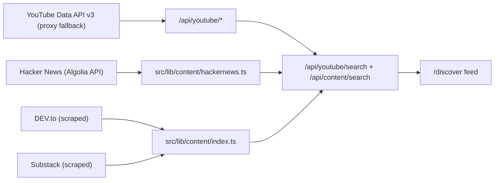
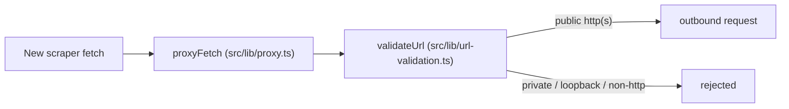

# Platform Integrations and Scrapers

> **Read this first.** The free platform scrapers the brief implies — X/Twitter,
> Instagram, TikTok and LinkedIn — are **not** in the current codebase.
> `SCRAPING_SETUP.md` marks itself *superseded* and says those scrapers "were
> removed in a prior cleanup"; the live sources are Hacker News, DEV.to and
> Substack, with YouTube added through its Data API in `PLATFORM_GUIDE.md`. This
> page separates what actually ships from what was only ever designed.

## What is ingested today



- **YouTube** — not scraped. It uses the YouTube Data API v3 with proxy fallback
  (`proxyFetch`) behind `/api/youtube/search`, `/api/youtube/channel`,
  `/api/youtube/channel-search`, `/api/youtube/transcript` and `/api/youtube/video`.
- **Hacker News** — the Algolia API, in `src/lib/content/hackernews.ts`.
- **DEV.to** — scraped through `src/lib/content/index.ts`; **Substack** is scraped.
- **Articles** — `src/lib/content/article-extraction.ts` parses title, content,
  images, author, published date and HTML entity decoding.
- **Removed** — Google News, Reddit, Instagram, TikTok, LinkedIn and X/Twitter,
  deleted in a prior cleanup.

## The retired platform scrapers

`SCRAPING_SETUP.md` is kept only as historical design notes, and it says so at the
top: the proxy-pool / session-cookie / CAPTCHA infrastructure it describes is
**not present** in the code. That includes the env vars `PROXY_URL`,
`PROXY_1`–`PROXY_10`, `X_COOKIES`, `INSTAGRAM_COOKIES`, `TIKTOK_COOKIES`,
`LINKEDIN_COOKIES`, `TWOCAPTCHA_API_KEY`, `ANTICAPTCHA_API_KEY`, and the
`npm run test:scrapers` / `test-scrapers.ts` / `test-full-integration.ts`
scripts. Do not follow its cookie-pasting instructions for this repository.

## Video and article handling

- **Transcripts** are surfaced by the `/api/youtube/transcript` endpoint. Which
  library fetches them, and how they are cached, is **not visible in the provided
  sources**.
- **YouTube description handling** is **not visible in the provided sources** — no
  description-parsing behaviour is described, only the endpoint list above.
- **Article extraction** is the visible parsing layer: `article-extraction.ts`
  returns title, content, images, author and published date, with entity decoding
  (`PLATFORM_GUIDE.md`).

## Platform-visibility quirks

The brief asks for quirks "fixed over time", but **no such history is visible in
the provided sources** — neither excerpt records visibility bugs or their fixes.
The one forward-looking artefact that *is* visible: the Instagram format option
(`reels` / `carousel` / `photos` / `all`) exists in the filter dropdown even
though "Instagram isn't in the feed yet", so the option is inert.

## Credentials and proxies

- **Proxy** (`src/lib/proxy.ts`): reads the standard `HTTPS_PROXY` /
  `https_proxy` / `HTTP_PROXY` / `http_proxy` env vars. If none are set, it
  auto-detects a proxy on the common local ports `7890`, `7897`, `1080`,
  `10809`, `8080`, `8118`.
- **LLM path** (`src/lib/generation/llm.ts`): the generation routes read the
  endpoint, model and key from `KIMI_API_ENDPOINT`, `KIMI_MODEL` and
  `KIMI_API_KEY`; proxy routing is opt-in via `KIMI_USE_PROXY=true`.
- **Platform OAuth**: the `/settings/performance` "Analytics Connections" panel
  lists YouTube, X, Instagram and Facebook OAuth but is currently **not
  configured** — Connect reports that OAuth is not configured and to add
  credentials to enable it.
- The cookie / CAPTCHA env vars above belong to the retired design, not live code.

## What the SSRF guard requires of new scrapers



`proxyFetch` runs **every** outbound URL through an SSRF guard — `validateUrl` in
`src/lib/url-validation.ts` — that rejects private, loopback and non-http targets.
A new scraper therefore must route its requests through `proxyFetch` rather than
calling `fetch` directly.

## Rate limiting

- **No current scraper rate limiter is visible in the provided sources.**
- The per-platform table in `SCRAPING_SETUP.md` (X 5/min, 5s base, 3 retries;
  Instagram 8/3s/3; LinkedIn 3/10s/2; TikTok 10/2s/3, exponential backoff capped
  at 60s) describes the **superseded** design, not shipped behaviour.
- On the generation side, every route shares a single `callLLM` wrapper and passes
  its own `CallLLMOptions` (max_tokens, timeout, retries, empty fallback) — LLM
  retry policy, not scraper throttling.

## Contributor checklist for a new platform

1. **Fetcher** — add it under `src/lib/content/` alongside `hackernews.ts` /
   `index.ts` / `article-extraction.ts`.
2. **SSRF** — send all requests through `proxyFetch` so `validateUrl` screens
   private / loopback / non-http targets.
3. **UI surface** — expose it in `FilterDropdown` via `useDiscoverFilters`
   (platform multi-select plus a per-platform format list), matching the
   YouTube / HackerNews / DEV.to / Substack pattern.
4. **Scoring** — give items a score on the article path
   (`calculateContentDiscoveryScore`) so they sort into the unified feed.
5. **Auth, if any** — expect "Analytics Connections" to report OAuth as
   unconfigured until credentials are added; there is no live cookie/CAPTCHA path
   to reuse.
6. **Rate limiting** — nothing to copy: no active scraper rate limiter is visible,
   so define one deliberately rather than inheriting the retired table.

<!-- relay:claims -->
```relay-claims
{"claims":[{"claim":"SCRAPING_SETUP.md marks itself superseded and says the proxy-pool, session-cookie and CAPTCHA infrastructure it describes - including the env vars PROXY_URL, PROXY_1 through PROXY_10, X_COOKIES, INSTAGRAM_COOKIES, TIKTOK_COOKIES, LINKEDIN_COOKIES, TWOCAPTCHA_API_KEY and ANTICAPTCHA_API_KEY plus the npm run test:scrapers, test-scrapers.ts and test-full-integration.ts scripts - is not present in the codebase.","path":"SCRAPING_SETUP.md","lines":[3,26]},{"claim":"SCRAPING_SETUP.md states that the Instagram, TikTok, LinkedIn and X/Twitter scrapers were removed in a prior cleanup and that the only active content sources are Hacker News, DEV.to and Substack, none of which require cookies or CAPTCHA solving.","path":"SCRAPING_SETUP.md","lines":[10,13]},{"claim":"src/lib/proxy.ts reads the standard HTTPS_PROXY, https_proxy, HTTP_PROXY and http_proxy env vars and, when none are set, auto-detects a proxy on the common local ports 7890, 7897, 1080, 10809, 8080 and 8118.","path":"SCRAPING_SETUP.md","lines":[15,19]},{"claim":"proxyFetch runs every outbound URL through an SSRF guard, validateUrl in src/lib/url-validation.ts, that rejects private, loopback and non-http targets.","path":"SCRAPING_SETUP.md","lines":[20,22]},{"claim":"The superseded design's rate-limit table gives X 5 requests/min with a 5s base delay and 3 retries, Instagram 8/3s/3, LinkedIn 3/10s/2 and TikTok 10/2s/3, with exponential backoff capped at 60 seconds.","path":"SCRAPING_SETUP.md","lines":[147,159]},{"claim":"TubeForge (Outlierly) is a content discovery and creation tool that surfaces outlier-performing videos and articles across YouTube, Hacker News, DEV.to and Substack, built on Next.js 16 with the App Router, React 19, TypeScript, Firebase Auth plus Firestore and Tailwind CSS.","path":"PLATFORM_GUIDE.md","lines":[7,9]},{"claim":"PLATFORM_GUIDE.md lists YouTube as served by /api/youtube/search, /api/youtube/channel, /api/youtube/channel-search, /api/youtube/transcript and /api/youtube/video using the YouTube Data API v3 with proxy fallback, Hacker News via the Algolia API in src/lib/content/hackernews.ts, DEV.to scraped through src/lib/content/index.ts, Substack scraped, and article parsing in src/lib/content/article-extraction.ts.","path":"PLATFORM_GUIDE.md","lines":[214,226]},{"claim":"PLATFORM_GUIDE.md says the Instagram format option (reels/carousel/photos/all) is forward-looking because Instagram is not in the feed yet.","path":"PLATFORM_GUIDE.md","lines":[76,82]},{"claim":"PLATFORM_GUIDE.md says the /settings/performance Analytics Connections panel lists YouTube, X, Instagram and Facebook OAuth but is not configured, showing an error that OAuth is not configured and to add credentials to enable it.","path":"PLATFORM_GUIDE.md","lines":[140,152]}]}
```
