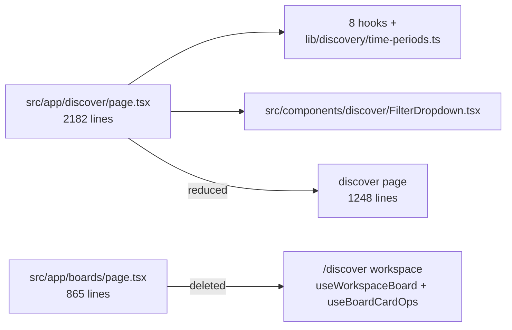
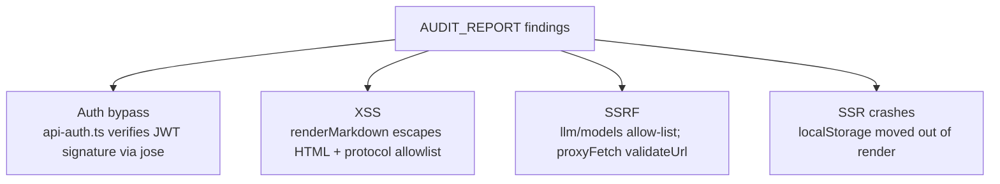

# Project History and Design Churn

This page explains the *why* behind the biggest design shifts, so contributors do not silently undo deliberate decisions. It is drawn from three documents that are all explicitly historical — `REFACTOR_PROGRESS.md`, `AUDIT_REPORT.md`, and `BUGS-FIXED.md` — so read them as rationale, not as a current map of the tree.

## The discover god-component refactor (2026-07-07/08)

The refactor started from a **2182-line** `src/app/discover/page.tsx` holding 40 `useState`, 14 `useEffect`, 13 handlers, 6 inline `fetch()` calls, duplicated cutoff tables, and dead state, next to an **865-line** `src/app/boards/page.tsx` with the same Firestore-layer duplication and no React Query usage.

The extraction produced eight hooks (`useBlocklistSync`, `useCategories`, `useChatSessions`, `useDiscoverFilters`, `useDiscoverData`, `useWorkspaceBoard`, `useCreatorSearch`), shared helpers in `src/lib/discovery/time-periods.ts`, and a self-contained `src/components/discover/FilterDropdown.tsx`. The page fell from 2182 → **1248 lines (−43%)**, with `tsc --noEmit` and `next build` green after every step.

Two outcomes are intentional, not accidents:

- **No React Query migration.** The audit flagged the standing rule that server state belongs in React Query, but the hooks still use plain `fetch` + `useState`; migration was declared a separate, larger, out-of-scope refactor.
- **`useDiscoverData` deliberately does not own `selectedTimePeriod`.** The filters hook needs `videos` from the data hook, so to break the circular dependency the parent page passes `timePeriod` into the fetch functions at call time.



## The audit-and-fix sweep (2026-07-23)

`AUDIT_REPORT.md` is a point-in-time snapshot that states plainly every listed finding has since been resolved, deferring to `BUGS-FIXED.md` for verified status. The sweep closed real security classes rather than cosmetics:



Remembering the filter findings explains the current shape of filtering: the article platform filter never matched, because `selectedPlatforms` held labels like `twitter`/`substack`/`instagram`/`tiktok`/`linkedin` while content items carried sources like `hackernews`/`reddit`/`devto`/`googlenews`. The fix moved filtering into `src/hooks/useDiscoverFilters.ts`, outlier minimums into `getOutlierMin()` in `src/lib/discovery/time-periods.ts`, and platform→source mapping into `platformsToSources()`.

## Boards → Workspace: a deliberate deletion

The dedicated board surface was removed on purpose. `src/app/boards/page.tsx`, `src/components/board/BoardCanvas.tsx`, and the `useBoardsData` / `useBoardCards` / `useCardEditor` / `useBoardChatPanel` hooks are **gone**, board management now lives entirely in the `/discover` workspace via `useWorkspaceBoard` + `useBoardCardOps`, and the `/api/boards/**` routes were removed as well. `src/components/chat/ChatPanel.tsx` was also removed, leaving `ChatSessionsModal.tsx`.

The visible reasoning is consolidation: two parallel god-components and their duplicated Firestore layers collapsed into one workspace. Stale references to `/boards`, `BoardCanvas`, or `ChatPanel` are historical, not intended targets.

## The platform-label cleanup

The sources do **not** support a "free scrapers" story. X/Substack/Instagram/TikTok/LinkedIn appear here as filter labels and types, not as implemented scrapers. In fact `BUGS-FIXED.md` records the opposite motion: the `x`/`instagram`/`tiktok`/`linkedin` label cases were removed from `sources.ts` as dead code.

## What the sources do not show

- **"Twenty-four findings."** No excerpt states that figure. `AUDIT_REPORT.md`'s visible findings run to #19, and `BUGS-FIXED.md` cites numbers up to #76 — the exact count is not visible in the provided sources.
- **A free-scraper wave** for X, Substack, Instagram, TikTok, LinkedIn — not visible.
- **Eden-style card/filter redesigns** — the name "Eden" appears nowhere in the excerpts.
- **A landing-page redesign that dropped pricing** — not visible; the only landing evidence is a runtime `GET / 200`.
- **An open-source-readiness push** — not visible.

<!-- relay:claims -->
```relay-claims
{"claims":[{"claim":"Board management was deliberately removed from a dedicated surface: src/app/boards/page.tsx, src/components/board/BoardCanvas.tsx, and the useBoardsData/useBoardCards/useCardEditor/useBoardChatPanel hooks were deleted, and board management now lives entirely in the /discover workspace via useWorkspaceBoard plus useBoardCardOps.","path":"REFACTOR_PROGRESS.md","lines":[8,11]},{"claim":"src/components/chat/ChatPanel.tsx was removed, and src/components/chat/ChatSessionsModal.tsx is what remains.","path":"REFACTOR_PROGRESS.md","lines":[12,13]},{"claim":"The refactor started from a 2182-line src/app/discover/page.tsx and an 865-line src/app/boards/page.tsx, with no React Query usage.","path":"REFACTOR_PROGRESS.md","lines":[22,24]},{"claim":"The final-state table records src/app/discover/page.tsx shrinking from 2182 to 1248 lines (about -43%), with new hooks and a FilterDropdown component extracted.","path":"REFACTOR_PROGRESS.md","lines":[115,117]},{"claim":"The refactor deliberately did not migrate to React Query; the extracted hooks still use plain fetch and useState, and the migration was declared a separate, larger, out-of-scope refactor.","path":"REFACTOR_PROGRESS.md","lines":[141,146]},{"claim":"useDiscoverData intentionally does not own selectedTimePeriod, so the parent page passes timePeriod at call time to break the circular dependency between the data and filters hooks.","path":"REFACTOR_PROGRESS.md","lines":[151,153]},{"claim":"The audit header records that the filter fixes moved filtering into src/hooks/useDiscoverFilters.ts, moved outlier minimums to getOutlierMin() in src/lib/discovery/time-periods.ts, and mapped platforms to sources with platformsToSources().","path":"AUDIT_REPORT.md","lines":[12,18]},{"claim":"AUDIT_REPORT.md is a point-in-time snapshot dated 2026-07-23 whose findings have all since been resolved, deferring to BUGS-FIXED.md for verified fix status.","path":"AUDIT_REPORT.md","lines":[3,19]},{"claim":"The audit found the article platform filter never matched because selectedPlatforms held labels such as twitter/substack/instagram/tiktok/linkedin while content items carried sources like hackernews/reddit/devto/googlenews.","path":"AUDIT_REPORT.md","lines":[62,68]},{"claim":"src/lib/api-auth.ts was rewritten to verify the Firebase ID token signature via jose against Google's JWKS, and validateUserAccess now rejects with 401 instead of allowing, with a forged unsigned JWT returning 401 at runtime.","path":"BUGS-FIXED.md","lines":[13,17]},{"claim":"The x/instagram/tiktok/linkedin label cases were removed from sources.ts as dead code.","path":"BUGS-FIXED.md","lines":[59,60]},{"claim":"jose was added as a direct dependency.","path":"BUGS-FIXED.md","lines":[63,64]}]}
```
